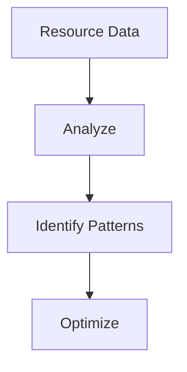

# Analytics & Optimization

Resource analytics and optimization.

## Features

- Utilization analytics
- Cost analysis
- Efficiency metrics
- Trend analysis
- Benchmarking
- Recommendations
- Optimization scenarios
- Custom reports
