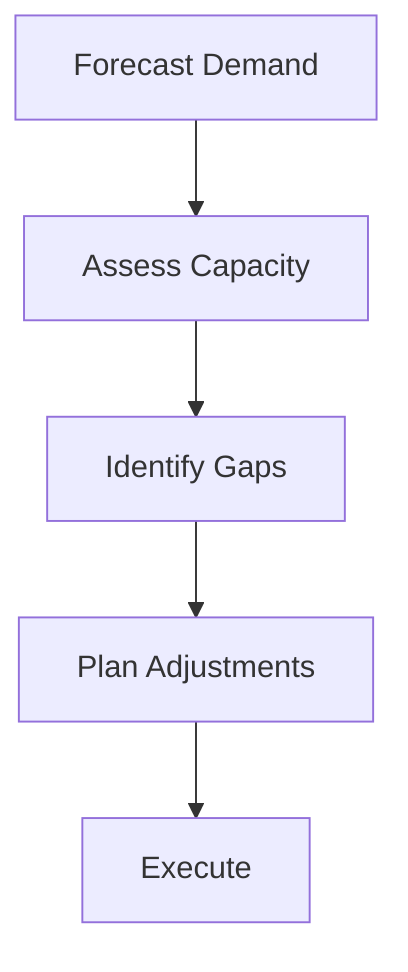

# Capacity Planning

Capacity planning and analysis.

## Features

- Demand forecasting
- Resource availability
- Utilization rates
- Capacity analysis
- Gap identification
- Planning scenarios
- What-if analysis
- Reporting dashboards
