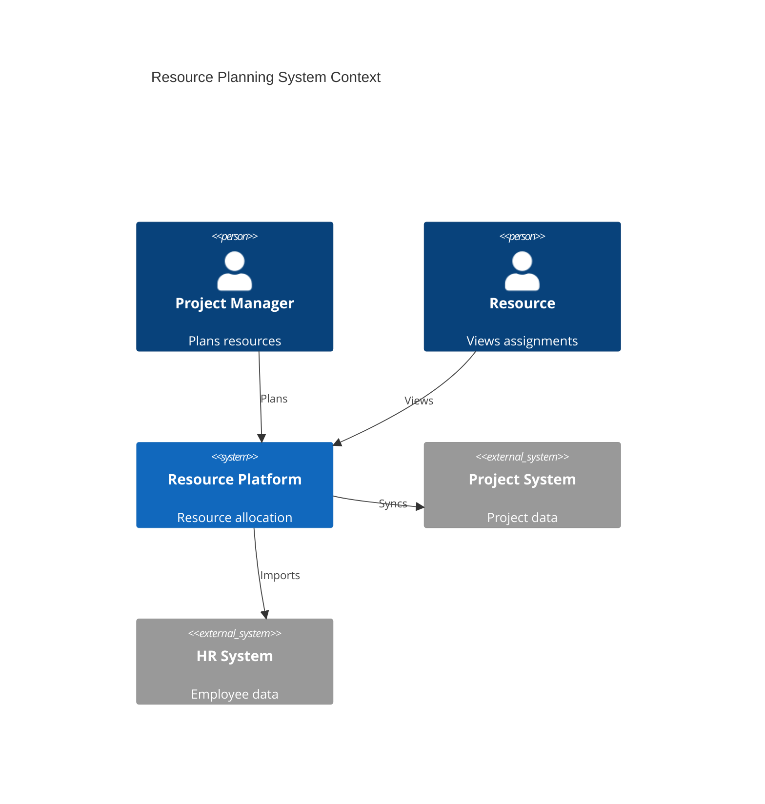
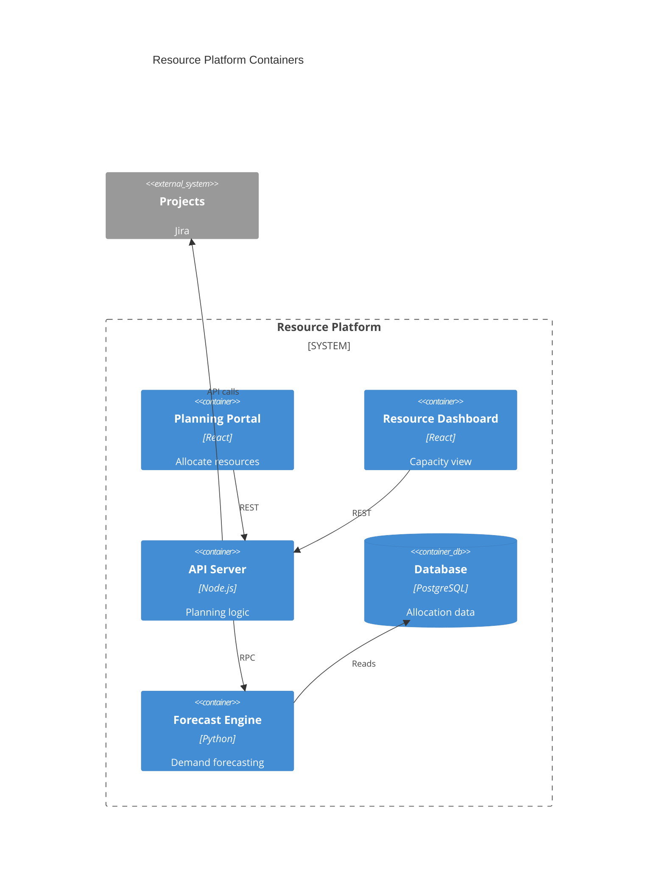
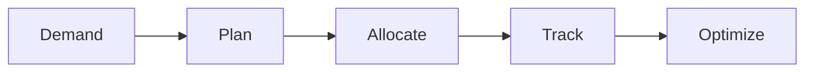

# Resource Planning

Enterprise resource planning.

## System Context

## System Containers

## Overview

## Features

- Resource inventory
- Capacity planning
- Demand forecasting
- Resource allocation
- Utilization tracking
- Skill mapping
- Availability calendars
- Resource optimization
