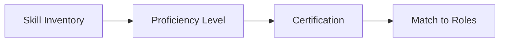

# Skill Management

Resource skill management.

## Features

- Skill catalog
- Proficiency levels
- Certification tracking
- Training records
- Skill assessments
- Skills matching
- Career development
- Learning plans
