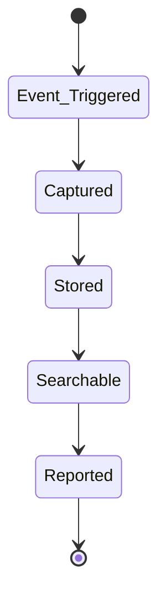

# Audit Logging

Complete audit trail for compliance and security monitoring.

## Logged Activities

- User logins and logouts
- Data access and modifications
- Permission changes
- Configuration changes
- API calls
- Admin actions
- Security events
- Failed access attempts

## Features

- Real-time logging
- Immutable audit trail
- Long-term retention
- Search and filtering
- Report generation
- Alert on suspicious activity
- Integration with SIEM systems

## Retention Policies

- 90 days hot storage
- 7 years cold storage
- Automatic archival
- Compliance retention
- User data deletion requests
