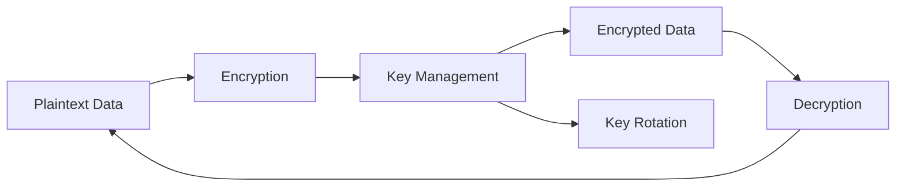

# Encryption

Comprehensive encryption system for protecting sensitive data.

## Encryption Types

- **At Rest**: AES-256-GCM
- **In Transit**: TLS 1.3
- **Field-level**: Per-field encryption
- **Database**: Full disk encryption
- **Backups**: Encrypted backups

## Key Management

- Hardware security modules
- Key rotation policies
- Secure key storage
- Key access logging
- Backup keys
- Disaster recovery keys

## Implementation

- Transparent encryption
- Zero-knowledge architecture
- Compliance with standards
- Performance optimization
