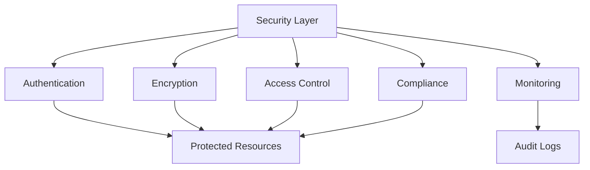

# Security

Enterprise-grade security features and compliance management.

## Security Features

- End-to-end encryption
- Data encryption at rest
- SSL/TLS for all connections
- API key management
- OAuth 2.0 support
- Two-factor authentication
- IP whitelisting

## Compliance

- GDPR compliance
- CCPA compliance
- SOC 2 Type II certified
- HIPAA support
- Data residency options
- DPA and BAA support

## Monitoring & Logging

- Real-time threat detection
- Intrusion detection
- Audit logging
- Security event monitoring
- Vulnerability scanning
- Penetration testing

## Integration Points

- **User Management**: Authentication
- **Audit System**: Compliance tracking
- **Notifications**: Security alerts
- **Data Management**: Encryption
