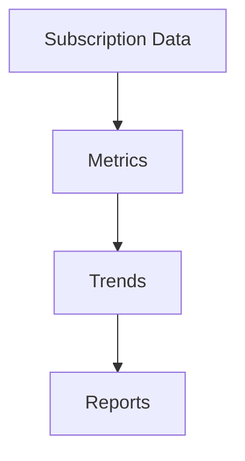

# Analytics

Subscription metrics and analytics.

## Metrics

- MRR/ARR
- Churn rate
- LTV
- Customer acquisition cost
- Upgrade/downgrade rates
- Plan distribution
- Revenue forecasts
- Growth trends
