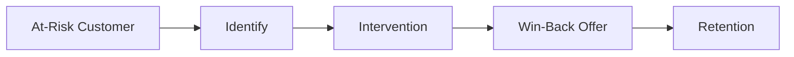

# Churn Prevention

Churn prediction and prevention strategies.

## Tools

- Churn prediction
- At-risk identification
- Win-back campaigns
- Incentive offers
- Usage recommendations
- Support escalation
- Feedback collection
- Pause options
