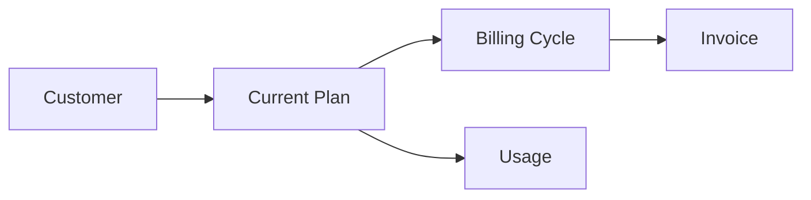

# Customer Management

Customer subscription management.

## Features

- Customer profiles
- Current plan view
- Billing information
- Payment methods
- Usage tracking
- Plan changes
- Upgrade options
- Downgrade options
