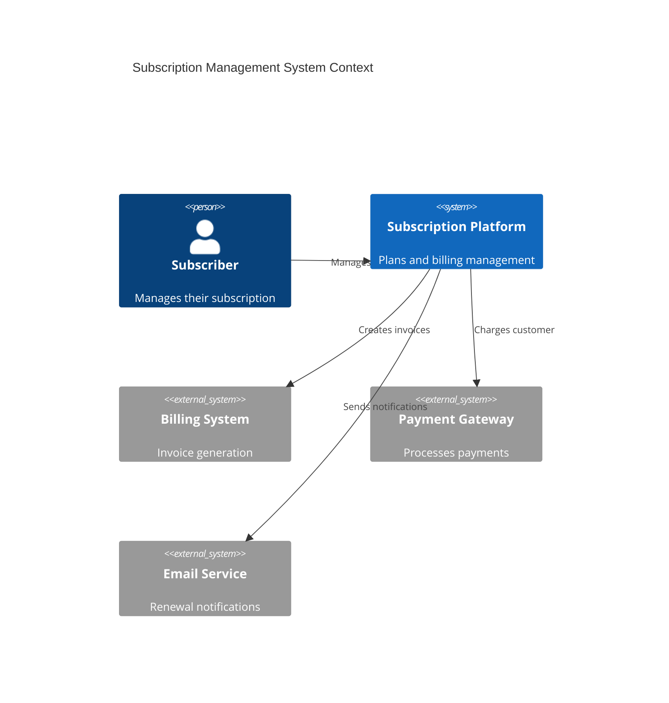
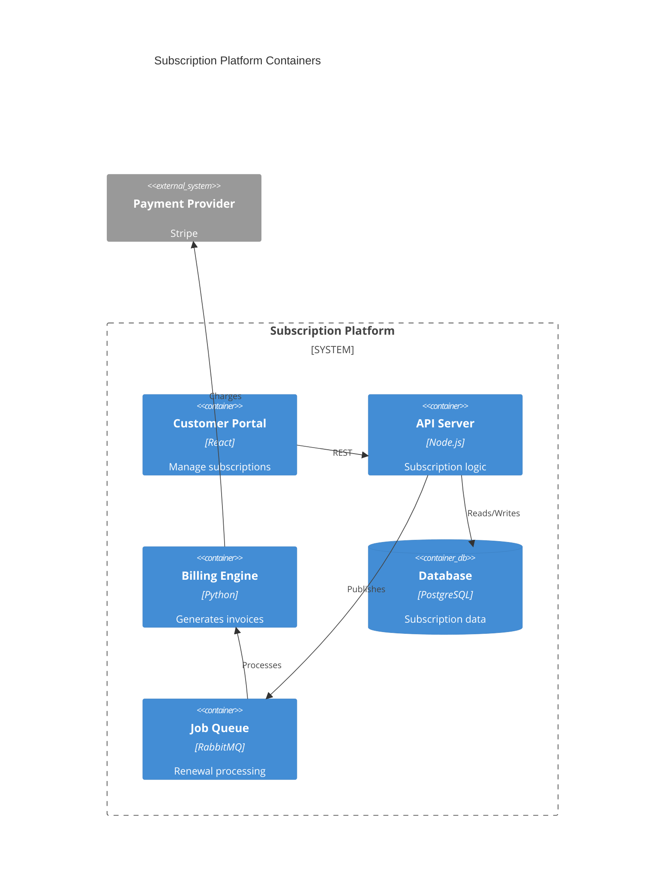
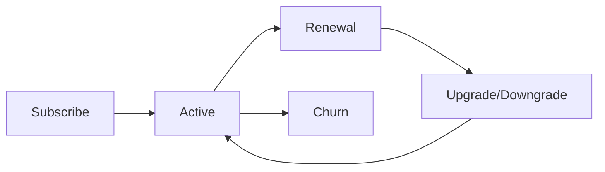

# Subscription Management

Subscription plans and lifecycle management.

## System Context

## System Containers

## Overview

## Features

- Subscription plans
- Recurring billing
- Plan upgrades
- Plan downgrades
- Pause subscriptions
- Cancellation management
- Renewal tracking
- Churn prevention
