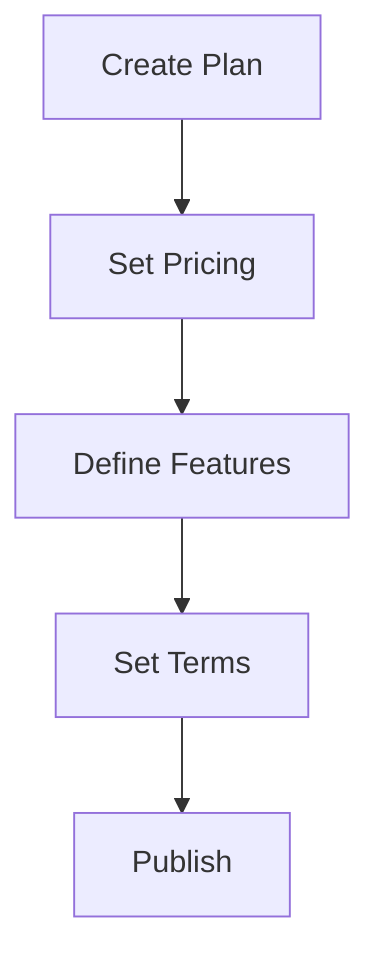

# Subscription Plans

Plan design and configuration.

## Plan Setup

- Plan name and description
- Billing frequency
- Base price
- Trial period
- Setup fees
- Feature inclusions
- Cancellation terms
- Renewal automation
