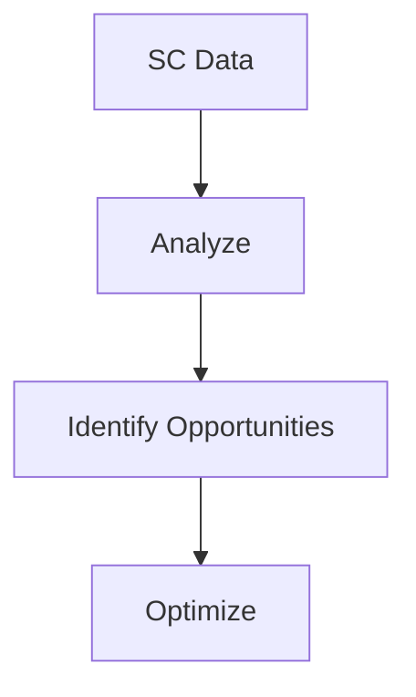

# Analytics & Optimization

Supply chain analytics and optimization.

## Features

- Cost analysis
- Performance metrics
- Risk analytics
- Scenario planning
- Sustainability tracking
- Benchmark analysis
- Predictive insights
- Optimization recommendations
