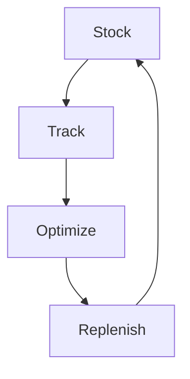

# Inventory Management

Supply chain inventory management.

## Features

- Real-time tracking
- Warehouse locations
- Cycle counting
- Inventory forecasting
- Stock optimization
- ABC analysis
- Shrinkage management
- Distribution network
