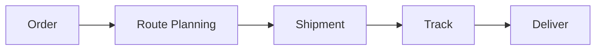

# Logistics Management

Logistics and transportation management.

## Features

- Route optimization
- Carrier management
- Shipment tracking
- TMS integration
- Rate management
- Detention tracking
- Delivery confirmation
- Performance metrics
