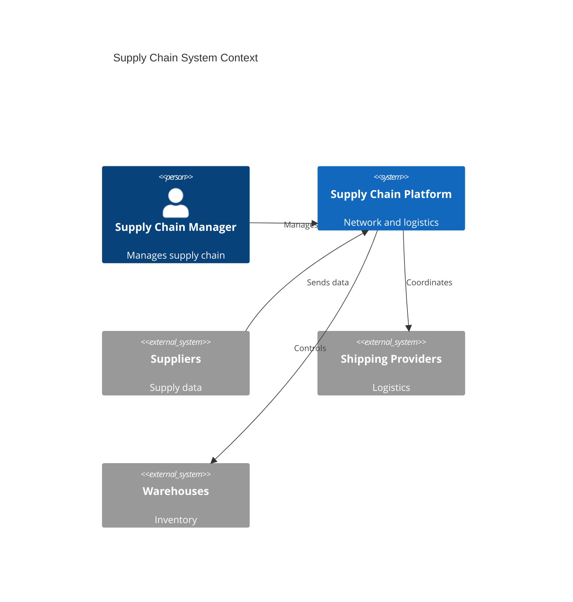
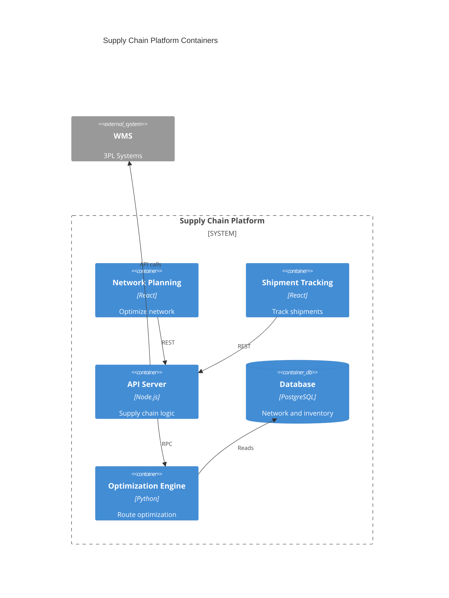
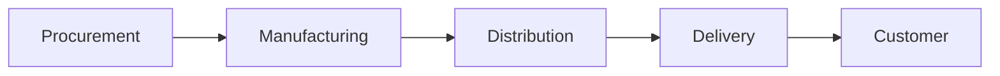

# Supply Chain

End-to-end supply chain management.

## System Context

## System Containers

## Overview

## Features

- End-to-end visibility
- Supplier management
- Logistics management
- Warehouse management
- Inventory tracking
- Performance analytics
- Risk management
- Sustainability tracking
