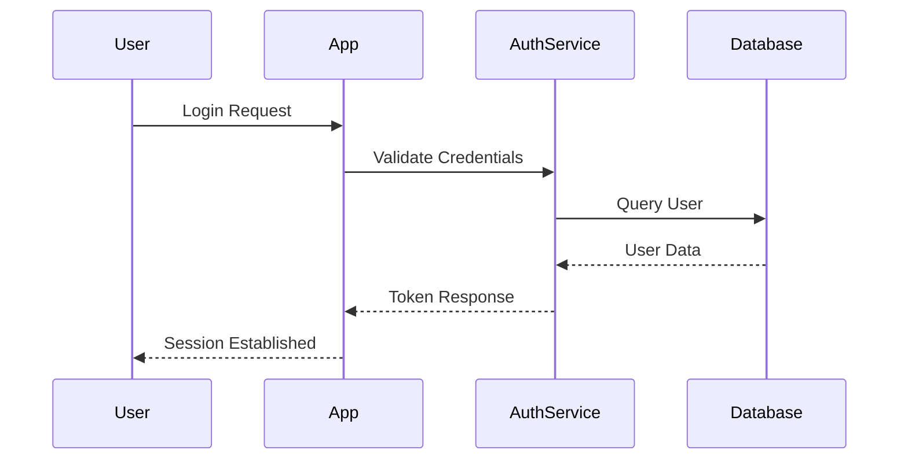

# Authentication

Implement secure authentication with multiple methods including password, OAuth, and SSO.

## Supported Methods

- Email & Password
- OAuth 2.0 (Google, GitHub, Microsoft)
- Single Sign-On (SSO)
- Multi-Factor Authentication (MFA)

## Security Features

- Password hashing with bcrypt
- Rate limiting on login attempts
- Session management with JWT tokens
- Secure cookie handling
- IP whitelisting support
