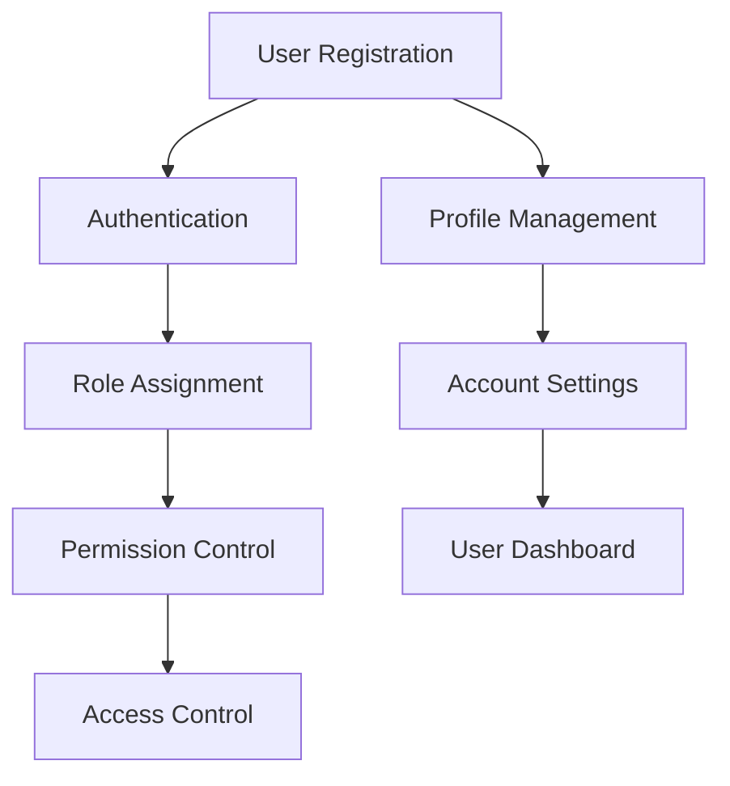

# User Management

The User Management system handles all aspects of user identity, authentication, and authorization within your SaaS platform.

## Key Features

- User registration and onboarding
- Profile management and customization
- Role-based access control (RBAC)
- Permission management
- Account settings and preferences
- Multi-factor authentication support

## Architecture Overview

This module integrates with the authentication system to provide seamless user management across the entire platform. Users can manage their profiles, update security settings, and administrators can assign roles and permissions.

## Integration Points

- **Authentication Module**: Validates user credentials
- **Notification System**: Sends user-related alerts
- **Audit Logging**: Tracks user actions for compliance
