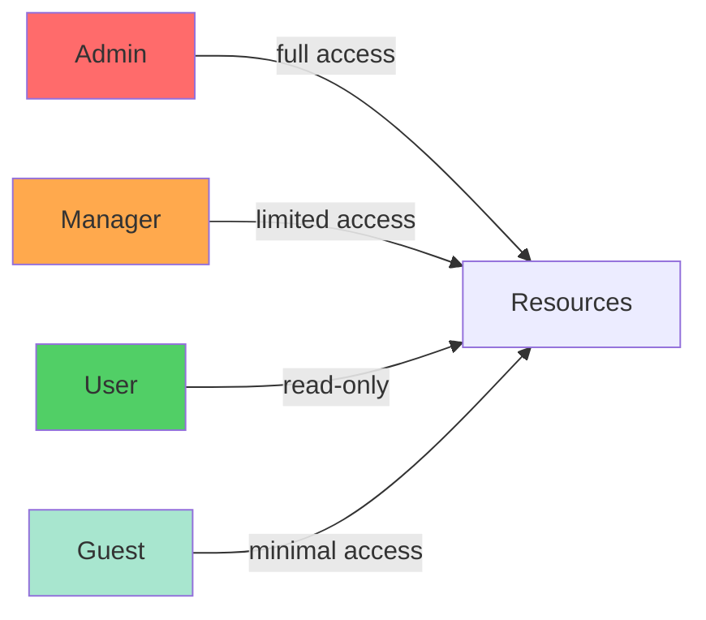

# Roles & Permissions

Manage granular permissions through a flexible role system.

## Role Hierarchy

- **Admin**: Full system access
- **Manager**: Team management and reporting
- **User**: Basic access to assigned features
- **Guest**: Limited read-only access

## Permission Types

- Create, Read, Update, Delete (CRUD)
- Resource-specific permissions
- Time-based access control
- IP-based restrictions
