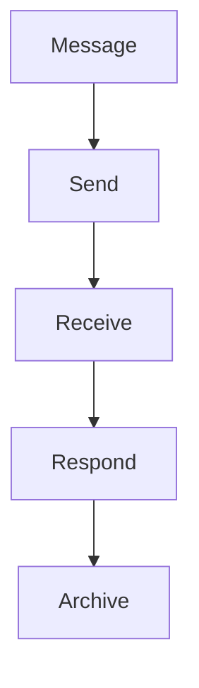

# Communication

Vendor communication hub.

## Features

- Messaging system
- Document sharing
- Purchase orders
- Invoices
- Issue tracking
- Notification system
- Portal access
- Communication logs
