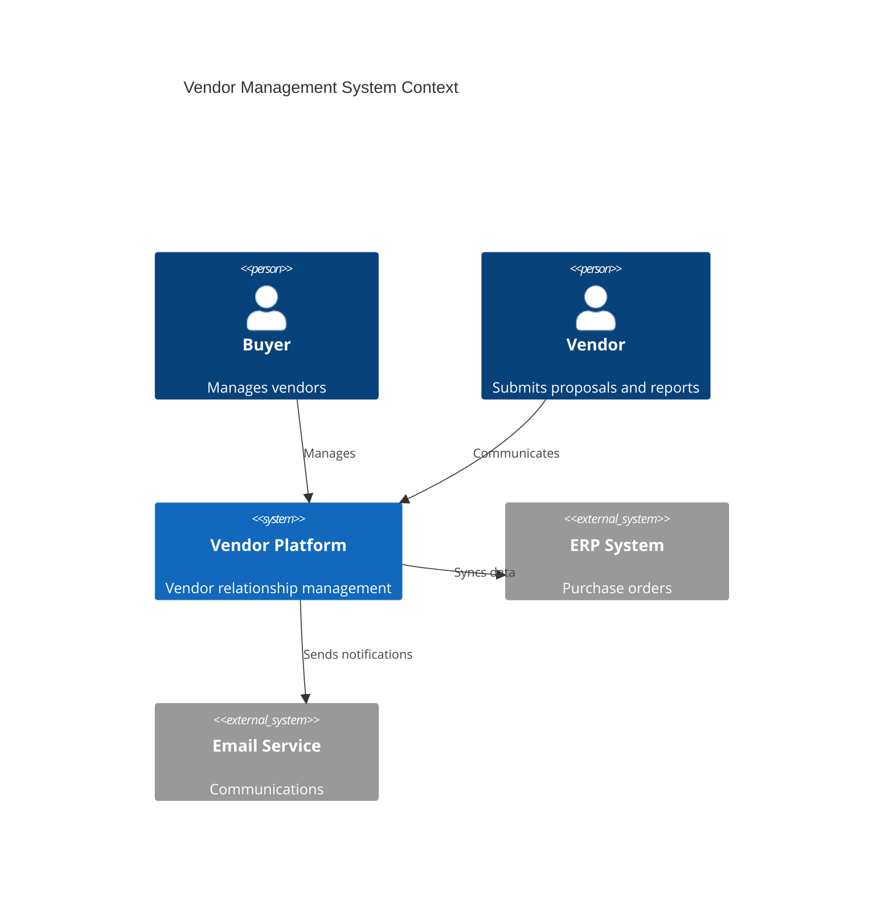
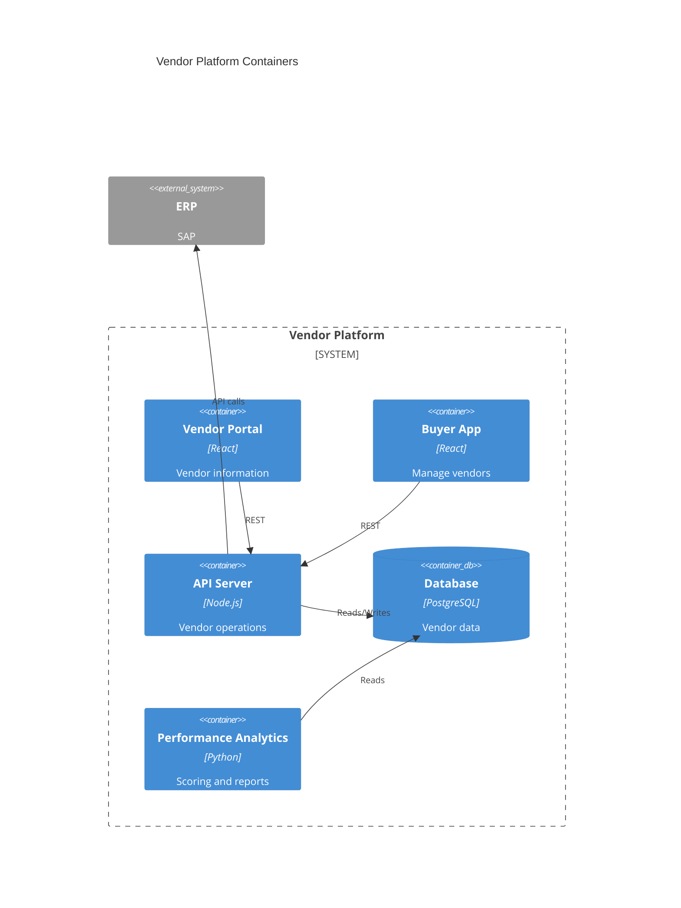
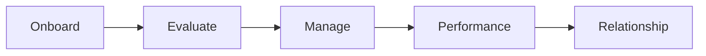

# Vendor Management

Vendor and supplier management.

## System Context

## System Containers

## Overview

## Features

- Vendor database
- Onboarding workflow
- Performance metrics
- Risk assessment
- Contract tracking
- Communication hub
- Payment processing
- Compliance tracking
