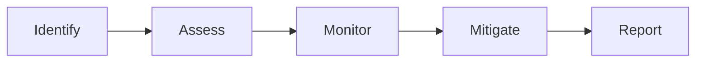

# Risk Management

Vendor risk assessment.

## Features

- Risk assessment
- Compliance checks
- Financial analysis
- Operational risk
- Cybersecurity assessment
- Monitoring alerts
- Mitigation planning
- Risk scoring
