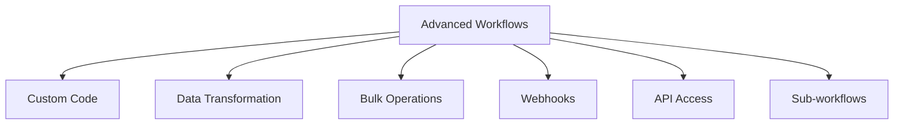

# Advanced Features

Advanced features for complex workflow scenarios and enterprise needs.

## Advanced Capabilities

- Custom JavaScript/Python code
- Complex data transformations
- Bulk operations on records
- Webhook triggers and callbacks
- REST API access
- Sub-workflow composition
- Dynamic branching
- Conditional loops

## Performance Features

- Parallel execution
- Batching
- Caching
- Rate limiting
- Throttling
- Load balancing
- Auto-scaling

## Enterprise Features

- Workflow versioning
- Environment management
- Team collaboration
- Change control
- Audit logging
- SLA tracking
