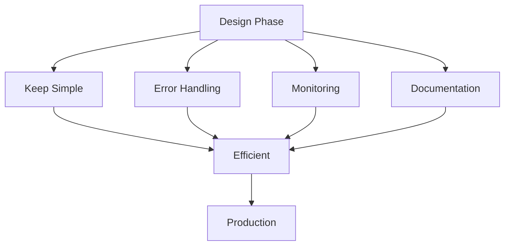

# Best Practices

Guidelines and best practices for designing efficient and maintainable workflows.

## Design Principles

- Keep workflows simple
- Use meaningful names
- Add comments and documentation
- Plan for errors
- Consider edge cases
- Test thoroughly
- Monitor continuously

## Performance Optimization

- Minimize API calls
- Use batching
- Cache data
- Parallel processing
- Reduce loop iterations
- Optimize conditions

## Maintenance

- Version control
- Update schedules
- Monitor performance
- Review logs
- Test changes
- Document changes
