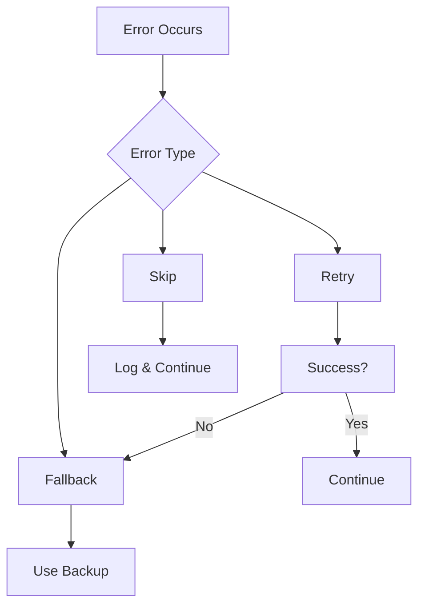

# Error Handling

Robust error handling and recovery mechanisms for reliable workflows.

## Error Handling Strategies

- Automatic retry with exponential backoff
- Fallback actions
- Alternative paths
- Skip on error
- Pause on error
- Notification on error

## Error Types

- Connection errors
- Timeout errors
- Validation errors
- Authorization errors
- Rate limiting
- Custom errors

## Recovery Options

- Retry with backoff
- Use cached data
- Execute fallback
- Manual intervention
- Escalation
- Dead letter queue
