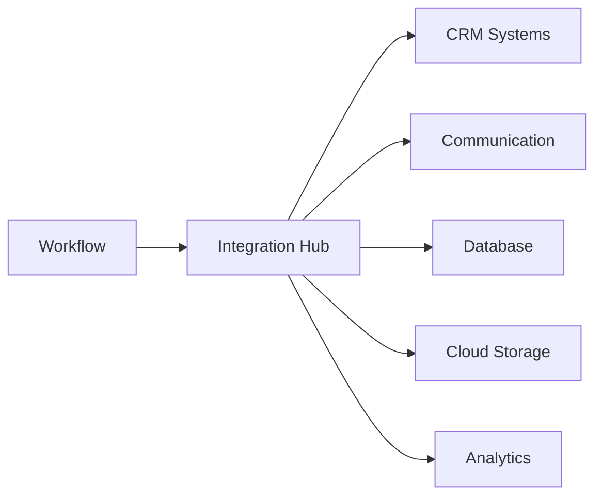

# Workflow Integrations

Seamlessly connect workflows with hundreds of business applications.

## Integrated Platforms

- Salesforce, HubSpot
- Slack, Teams, Email
- SQL, MongoDB, Firebase
- S3, Google Drive, OneDrive
- Stripe, PayPal
- Hubspot, Marketo
- Shopify, WooCommerce

## Integration Methods

- Native connectors
- Webhook integration
- REST API
- GraphQL
- Custom code blocks
- Data mapping

## Error Handling

- Retry policies
- Dead letter queues
- Error notifications
- Fallback actions
