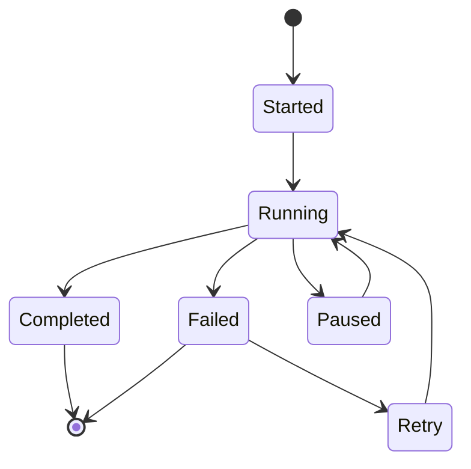

# Monitoring & Logs

Comprehensive monitoring and logging for workflow execution and troubleshooting.

## Monitoring Features

- Real-time execution status
- Performance metrics
- Success/failure rates
- Execution timeline
- Step-by-step logs
- Variable inspection
- Error tracking

## Log Types

- Execution logs
- Error logs
- Debug logs
- Audit logs
- Performance logs
- Integration logs

## Alerts & Notifications

- Workflow failures
- Timeout alerts
- Performance warnings
- Integration errors
