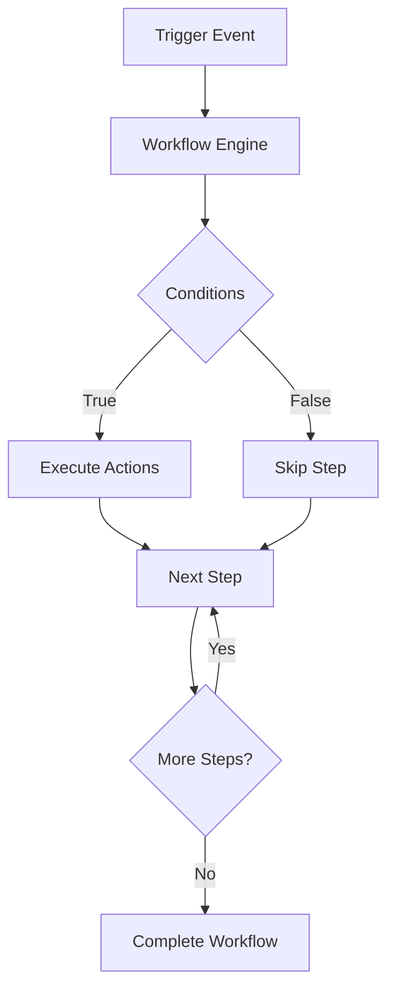

# Workflow Automation

Streamline business processes with intelligent workflow automation and orchestration.

## Core Features

- Visual workflow builder
- Conditional logic
- Multi-step automation
- Error handling and retries
- Scheduled workflows
- Real-time monitoring
- Audit trail
- Integration with 500+ apps

## Use Cases

- Lead assignment automation
- Invoice processing
- Approval workflows
- Data synchronization
- Customer onboarding
- Report generation
- Document management
- Support ticket routing
