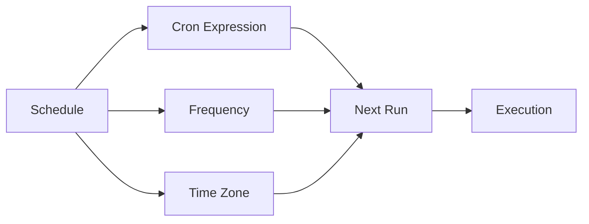

# Scheduled Workflows

Run workflows on a schedule using flexible scheduling options.

## Scheduling Options

- One-time execution
- Recurring daily
- Recurring weekly
- Recurring monthly
- Custom cron expressions
- Business day only
- Time zone aware

## Schedule Management

- View schedule
- Modify schedule
- Pause/resume
- Skip next run
- Manual trigger
- Historical executions

## Features

- Daylight saving time handling
- Holiday calendars
- Timezone conversion
- Execution history
- Missed execution handling
