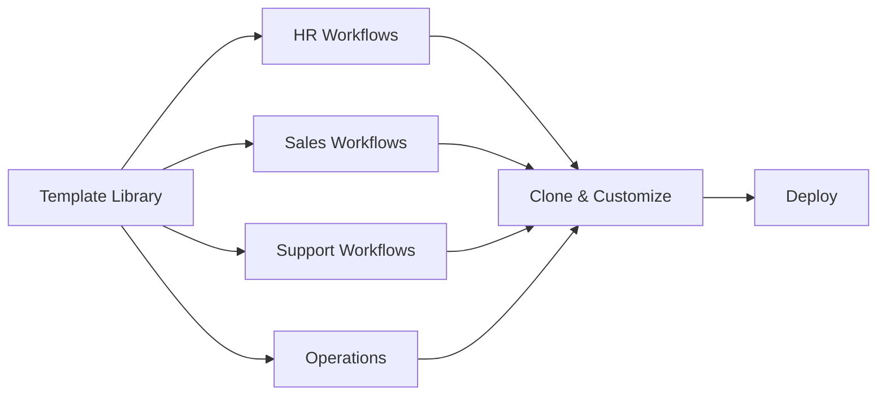

# Workflow Templates

Library of pre-built templates for common workflows and use cases.

## Template Categories

- **HR**: Onboarding, offboarding, payroll
- **Sales**: Lead scoring, opportunity creation
- **Support**: Ticket routing, escalation
- **Operations**: Approvals, data sync
- **Finance**: Invoice processing, payments
- **Marketing**: Lead nurturing, campaigns
- **IT**: Password resets, provisioning

## Template Features

- Pre-configured integrations
- Best practices included
- Customizable fields
- Clone and modify
- Version control
- Community templates
