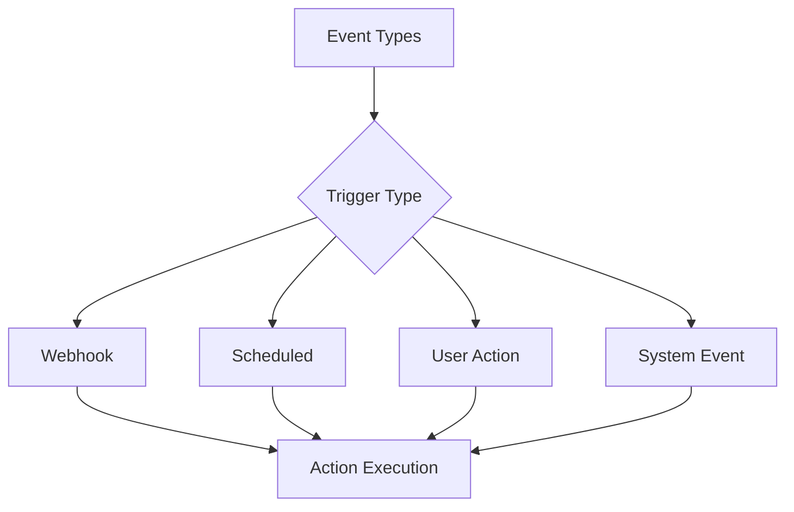

# Triggers & Actions

Configure events that start workflows and actions that perform work.

## Trigger Types

- **Event-based**: Webhook, API call
- **Scheduled**: Cron, interval-based
- **Manual**: User-initiated
- **System**: Database changes, conditions met

## Actions Available

- Create/update records
- Send notifications
- Execute API calls
- File operations
- Data transformation
- Conditional logic
- Wait/delay
- Script execution

## Trigger Configuration

- Event filtering
- Payload mapping
- Rate limiting
- Deduplication
